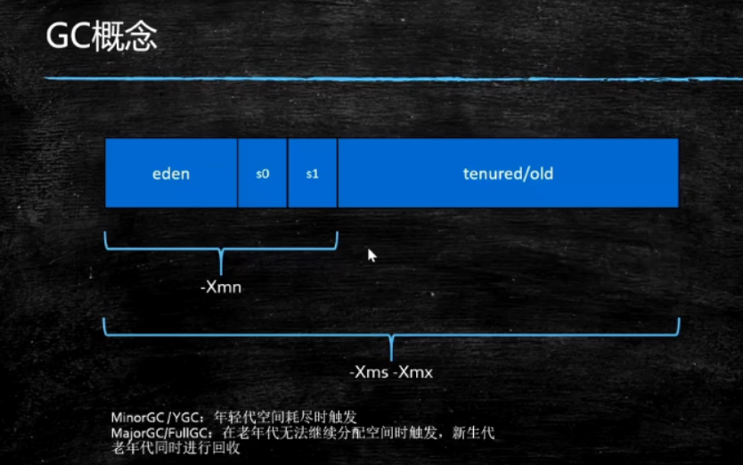
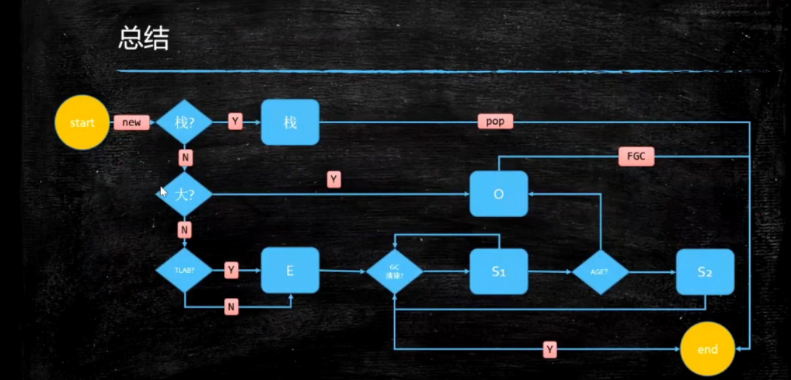
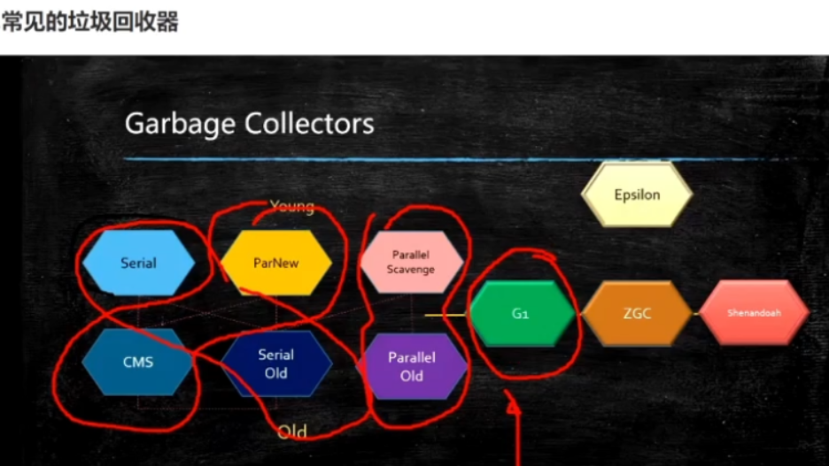
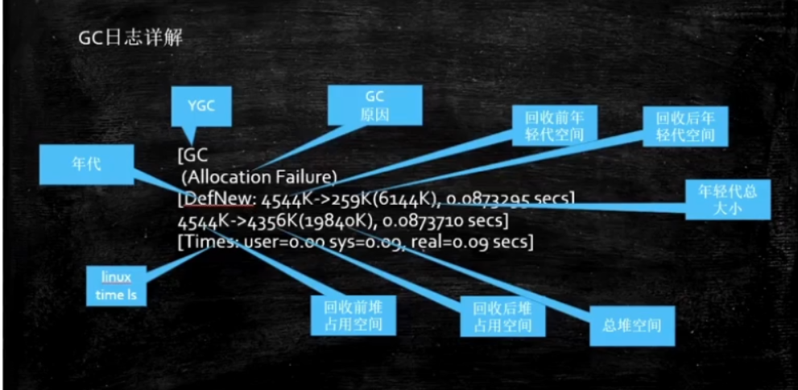

# JVM

## JVM基础入门

java通过javac转译class文件，classLoader通过java类库使用字节码解释器或者JIT即时编译器进行执行引擎；jvm是按需动态加载，采用双亲委派机制 

## 类加载-初始化

1. 加载过程

- loading（2进制加载内存）

  - 双亲委派：

    是一个孩子向父亲方向，然后父亲向孩子方向的双亲委派过程。

    1出于安全考虑，2减少加载

  - LazyLoading 的五种情况

    -new getstatic invokestatic指令，访问final变量除外

    -java.lang.reflect对类进行反射调用时

    -初始化子类的时候，父类首先初始化

    -虚拟机启动时，被执行的主类必须初始化

    -动态语言支持java.lang.invoke.MethodHandle解析的结果为REF getstatic REF putstatic REF invokestatic的方法句柄时，该类必须初始化

  - ClassLoader的源码

    findCache----parent.loadClass----findClass()

  - 自定义类加载器

    extend classLoader

    overwrite findClass()-----defineClass(byte[]---class clazz)

    加密

  - 混合执行：编译执行、解释执行

    检测热点代码：-XX:CompileThreshold=1000
    
  - 如何打破：重写loadClass()

  - 何时打破：

    - JDK1.2之前，自定义ClassLoader都必须重写loadClass（）

    - ThreadContextClassLoader可以实现基础类调用实现类代码，通过thread.setContextClassLoader指定。

    - 热启动、热部署

      tomcat都有自己的模块指定classloader

- Linking

  - Verification（校验） 
  - Preparation（将静态变量赋默认值）
  - Resolution（常量池中符号引用转换为内存地址）

- Initializing（静态变量赋值为初始值）

2. 类加载器


3. 存储器的层次结构


- 底层硬件一致性协议：MESI Cache一致性协议（intel的CPU用的，当然还有其他）

现代CPU的数据一致性实现=缓存锁（MESI...）+总线锁

- CPU为了提高指令执行效率，会在一条指令执行过程中（比如去内存读数据（慢100倍）），去同时执行另一条指令，前提是两条指令没有依赖关系。

3. 有序性保障

- CPU硬件内存屏障

sfence(写屏障)：在sfence指令前的写操作当必须在sfence指令后的写操作前完成

lfence(读屏障):在sfence指令前的读操作当必须在sfence指令后的读操作前完成

mfence(读写屏障):在sfence指令前的读写操作当必须在sfence指令后的读写操作前完成

原子指令：如x86上的“lock....”指令是一个Full Barrier，执行时会锁住内存子系统来确保执行顺序，甚至跨多个CPU，Software Locks通常使用内存屏障或原子指令来实现变量可见性和保持程序顺序。

- JVM级别如何规范

  - LoadLoad屏障
  - StoreStore屏障
  - LoadStore屏障
  - StoreLoad屏障
  
- volatile的实现细节

  - 字节码层面
    - ACC_VOLATILE
  - jvm层面
    - StoreStoreBarrier     volatile写操作    StoreLoadBarrier
    - LoaLoadBarrier    volatile读操作    LoadStoreBarrier
    - volatile内存区的读写都加屏障
  - os和硬件层面
    - 使用hsdis  HotSpot Dis Assembler观察windows  lock指令实现
  
- synchronized实现细节

  - 字节码层面

    - ACC_SYNCHRONIZED

    - monitorenter  monitorexit

  - jvm层面

    - C C++调用了操作系统提供的同步机制

  - os和硬件层面

    - X86: lock comxchg.xxx
  
- 对象创建过程？
  - class loading
  - class linking(verification,preoaration,resolution)
  - class initializing
  - 申请对象内存
  - 成员变量赋默认值
  - 调用构造方法<init>
    - 成员变量顺序赋初始值
    - 执行构造方法语句
  
- 对象在内存中的存储布局
  - 普通对象
    - 对象头：markword 8
    - ClassPointer指针：-XX:+UseCompressedClassPointers为4字节，不开启为8字节
    - 实例数据
      - 引用类型
    - padding对齐，8的倍数
  - 数组对象
    - 对象头：markword 8
    - ClassPointer指针
    - 数组长度：4字节
    - 数据数据
    - 对齐 8倍数
  
- Heap

- Method Area

  - Perm Space(1.8)

    字符串常量位于PermSpace

    FGC不会清理

    大小启动的时候指定，不能变

  - Meta Space(>=1.8)

    字符串常量位于堆

    会触发FGC清理

    不设定的话，最大就是物理内存

- Runtime Constant Pool

- Native Method Stack

- Direct Memory

  - jvm可以直接访问的内核空间的内存（OS管理的内存）
  - NIO，提高效率，实现zero copy

4. 常用指令

- store

- load

- pop

- mul

- sub

- invoke

  - invokeStatic

  - invokeVirtual

  - invokeinterface

  - invokeSpecial

    可以直接定位，不需要多态的方法

    private方法，构造方法

  -  invokeDynamic

    jvm最难指令

    lambda表达式或者反射或者其他动态语言scala kotlin,或者CGLib ASM,动态产生class，会用到的指令

## JVM调优理论-GC Collector  三色标记

没有引用标记的就是垃圾

查找垃圾的算法：

- Root Searching(根可达算法)
- 引用计数

清理垃圾的算法：

- Mark-Sweep（标记清除）
  - 算法相对简单
  - 存活对象比较多的情况下效率高
  - 两遍扫描，效率偏低
  - 容易产生碎片
- Copying(拷贝)
  - 先将内存一分为二，将有用的复制一份，其他的清掉
  - 效率高，没有碎片，浪费空间
- Mark-Compact（标记压缩）
  - 将有用的移到到前面
  - 没有碎片，效率偏低
  - 两遍扫描，指针需调整

jvm内存分代模型（用于分代垃圾回收算法）

- 部分垃圾回收器使用的模型
  - 除Epsilon AGC Shendoah之外都是使用逻辑分代模型
  - G1是逻辑分代，物理不分代
  - 除此之外不仅逻辑分代，而且物理分代



- 栈上分配
  - 线程私有小对象
  - 无逃逸
  - 支持标量替换
  - 无需调整
- 线程本地分配TLAB
  - 占用eden，默认1%
  - 多线程的时候不用竞争eden就可以申请空间，提高效率
  - 小对象
  - 无需调整
- 永久代（1.7）Perm Generation/元数据区（1.8）Metaspace（堆之外区域）
  - 永久代 元数据 -class
  - 永久代必须指定大小限制，元数据可以设置（1.7），也可以不设置，无上限（受限于物理内存）
  - 字符串常量（1.7--永久代 ） （1.8--堆）
  - MethodArea逻辑概念--永久代、元数据（class信息，代码编译信息、代码层次信息）
- 老年代
  - 顽固分子
  - 老年代满了FGC FULL GC
- 新生代=eden+2个suvivor区
  - YGC回收之后，大多数的对象会被回收，活着进入S0
  - 再次YGC，活着的对象eden+S0---》S1
  - 再次YGC，eden+S1---》S0
  - 年龄足够----》老年代（15 CMS  6）
  - S区装不下，----》老年代
- GC Tuning (Generation)
  - 尽量减少FGC
  - MinorGC=YGC
  - MajorGC=FGC

### YGC（Young GC） / MinorGC:

###### 其实是一个东西，作用都是针对新生代（young gen）进行的垃圾回收，新生代空间不足会触发。

### OldGC:

###### 针对老年代的垃圾回收，老年代空间不足会触发。

### FGC：

###### 针对新生代，老年代都进行一次垃圾回收，所以是 Full (全部)GC。在堆的使用率超过80% 会触发，代码中显式调用 ：System.GC；也会不定时触发。

### MixedGC:

###### G1收集器特有的概念，在堆内存使用率超过45%就会触发的对新生代和老年代都进行的一次混合型GC，效率会比FGC要高，功能和FGC类似。

### MajorGC:

###### Major(主要的)GC这个概念很模糊，有一批人觉得针对老年代的OldGC就是MajorGC，有一批觉得针对Young 和 old 同时进行的FGC才算是MajorGC。

对象何时进入老年代

- 超过XX:MaxTenuringThreshold指定次数  （：躲过指定垃圾回收次数）
  - Parallel Scavenge 15
  - CMS 6
  - G1 15
- 动态年龄  （ Survivor区域内年龄1+年龄2+年龄3+年龄n的对象总和大于Survivor区的50% ）
  - s1 -》s2超过50%
  - 把年龄最大的放入O
-  如果一次Young GC后存活对象太多无法进入Survivor区,此时直接进入老年代 
-  大对象直接进入老年代 

对象分配过程图



垃圾回收器历史过程。

jdk诞生Serial追随提高效率，诞生了PS(Parallel Scavenge)PO(parallel Old)，为了配合CMS，诞生了PN（ParNew），CMS是1.4版本后期引入，CMS是里程碑式的GC，它开启了并发回收的过程，但是CMS（concurrent mark sweep）毛病较多，因此目前没有任何一个JDK版本默认是CMS。并发是为了不要STW。

- Serial年轻代 串行回收

- PS 年轻代 并行回收

- ParNew年轻代 配合CMS的并行回收

- SerialOld

- ParallelOld

- ConcurrentMarkSweep老年代并发，垃圾回收和应用程序同时运行，降低STW的时间（20ms）

  三色标记+incremental Update

- G1(10ms)

  三色屏障+SATB

- ZGC(1ms)  PK  C++

  ColoredPointers+写屏障

- Shenandoah

  ColoredPointers+读屏障

- Eplison

- 默认 PS+ParallelOld

垃圾回收器和内存有关

- Serial 几十兆
- PS 上百兆 几个G
- CMS  20G
- G1 上百G
- ZGC 4T

CMS的问题

- Memory Fragmentation

  当使用内存比较大的服务器时，时间久了，内存碎片会比较多，老年代的内存占用过多，新生代到老年代的后内存不够用，这时会将serialOld出来清理，清理会特比慢。

- Floating Garbage

  当老年代占用过多，而在程序运行时产生浮动垃圾，这时有serialOld出来清理，

解决方案：降低触发CMS的阈值，以保持老年代有足够的空间 -XX:CMSSInitiatingOccupancyFractioin 92%

## JVM调优

内存泄漏memory leak（有个对象一直占用内存，其他对象也用不了，一直没回收）

内存溢出out of memory（一直创建对象，占用内存，直到爆了）

GC日志详解：



吞吐量：用户代码习性时间/（用户代码执行时间+垃圾回收时间）

响应时间：STW越短，响应时间约好

所谓调优：首先确定追求啥？吞吐量优先（PS+PO）【科学计算、数据挖掘、thrupt】，还是响应时间优先（1.8G1）【网站GUI API】，还是在满足一定时间的情况下，要求达到多大的吞吐量。。

什么是调优

- 根据需求进行JVM规范和预调优
- 优化运行JVM运行环境
- 解决JVM运行过程中出现的各种问题（OOM）

步骤：

- 熟悉业务场景（没有最好的垃圾回收器，只有最适合的垃圾回收器）
  - 响应时间、停顿时间（cms g1 zgc）
  - 吞吐量=用户时间/(用户时间+GC时间)
- 选择回收器组合
- 计算内存需求（经验值1.5 G 16G）
- 选定CPU（越高越高）
- 设定年代大小、升级年龄
- 设定日志参数
  - 自己设定（日志名字路径，多少个日志，每个日志多大）
  - 或者每天产生一个日志文件
- 观察日志情况

系统CPU经常100%，如何调优？

- 找出哪个进程CPU高（top）
- 找到该进程中哪个线程CPU高（top-Hp）
- 导出该线程的堆栈（jstack）
- 查找哪个方法（栈帧）消耗比较高（jstack）

系统内存飙高，如何查找问题？

- 导出堆内存（jmap）
- 分析（jhat jvisualvm mat jprofiler...）

如何监控JVM

- jstat jvisualvm jprofiler arthas top...

调优：

- java -Xms200M -Xmx200M -XX:+PrintGC com.mashibing.jvm.gc.T15_FullGC_Problem01

- 一般运维团队首先受到报警信息（CPU Memory）

- top命令观察到问题：内存不断增长 CPU占用率居高不下

- top -Hp 3462(进程号)   查看进程中的线程，哪个线程CPU和内存占比高

- jstack  10050(进程号)  查看具体线程，其中nid是12位数字对应上面命令中线程号（10进制）

- jps定位具体java进程

  jstack定位线程状况，重点关注：WAITING BLOCKED

  例如：waiting on <0x0000088ca3310>(java.lang.Object),假如有一个线程中有100个线程，很多线程都在waiting on<xx>,一定要找到哪个线程持有这把锁。搜索jstack dump的信息，找<xx>,看哪个线程持有这把锁RUNNABLE

- jinfo pid  查看进程在jvm中信息 

- jstat -gc 进程号 （时间【每多少秒打印】）动态观察gc情况/阅读GC日志发现频繁GC/arthas观察/jconsole/Jprofiler(最好用)

  - jconsole远程连接（设置参数）
  - Java VisualVM连接（容易）
  - Jprofiler（这个最好，这3个图形化界面自身会消耗cpu，图形化界面用于测试，压测）
  - cmdline arthas(非图形化界面)

  jstat -gc 4655 500：每500个毫秒打印GC的情况

- jmap -histo 4655 | head -20，查找有多少对象产生

- jmap -dump:format=b,file=xxx pid /jmap -histo

  线上系统，内存特别大，jmap执行期间会对进程产生很大影响，甚至卡顿（电商不适合）

  设定参数HeapDump,OOM的时候会自动产生堆转储文件

  很多服务器备份进行高可用，停掉这台服务器对其他服务器不影响

  在线定位

- java -Xms20M -Xmx20M -XX:+UseParallelGC -XX:+HeapDumpOnOutOfMermoryError com.mashibing.jvm.gc.T15_FullGC_Problem01

- 使用MAT/jhat进行dump文件分析

- 找到代码问题

arthas在线排查工具

案例汇总

OOM产生的原因多种多样，有些程序未必产生OOM，不断FGC（CPU飙高，但内存回收特别少）

- 硬件升级系统反而卡顿(在线文件阅读系统，原本1.5G内存，虽然慢，但能页面显示，但达到15G反而卡顿)

- 线程池不当运用产生OOM问题（不断往List加对象，Low，）

- smile jira问题  （12306晚上不准买票可能重启维护，游戏维护  ）

- tomcat max-http-header-size过大问题 （http相关的对象占内存比较大）

- lambda表达式导致方法区溢出问题

  LambdaGC.java  -XX:MaxMetaspaceSize=9M -XX:+PrintGCDetails

- 直接内存溢出问题（少见）

  《深入理解java虚拟机》P59，使用Unsafe分配直接内存，或者使用NIO的问题

- 栈溢出问题

  -Xss设定太小

- 重写finalize引发GC

  小米云，HBase同步，系统通过nginx访问超时报警，最后排查，C++程序员重写finalize引发频繁GC问题：C++要手动清理内存，finalize耗时比较长的操作

- 如果有个系统，内存一直消耗不超过10%，但观察GC日志，发现FGC总是频繁产生，会是什么引起的

  System.gc();有人使用了这个


## GC算法的基础概念

card Table

由于做YGC时，需要扫描整个OLD区，效率非常低，所以JVM设计了CardTable,如果一个OLD区CardTable中有对象指向Y区，就将它设为Dirty,下次扫描时，只需要扫描Dirty Card,在结构上，Card Table用BitMap来实现。

G1垃圾回收器会产生GFC,当老年代内存不足时。当产生FGC时，1、扩大内存；2、提高CPU性能（回收的快，业务逻辑产生对象的速度固定，垃圾回收越快，内存空间越大）3、降低MixedGC触发的阈值，让MixedGC提早发生（默认45%）

为什么G1用SATB

灰色--->白色引用消失时，如果没有黑色指向白色引用会被push到堆栈，下次扫描时拿到这个引用个，由于有RSet的存在，不需要扫描整个堆去查找指向白色的引用，效率比较高SATB配合RSet，浑然天成。

CMS和G1的优缺点

https://zhuanlan.zhihu.com/p/161204689

### CMS的优点：

- 支持并发收集.
- 低停顿,因为CMS可以控制将耗时的两个stop-the-world操作保持与用户线程恰当的时机并发执行，并且能保证在短时间执行完成，这样就达到了近似并发的目的.

### CMS的缺点：

- CMS收集器对CPU资源非常敏感,在并发阶段虽然不会导致用户线程停顿，但是会因为占用了一部分CPU资源，如果在CPU资源不足的情况下应用会有明显的卡顿。
- 无法处理浮动垃圾：在执行‘并发清理’步骤时，用户线程也会同时产生一部分可回收对象，但是这部分可回收对象只能在下次执行清理是才会被回收。如果在清理过程中预留给用户线程的内存不足就会出现‘Concurrent Mode Failure’,一旦出现此错误时便会切换到SerialOld收集方式。
- CMS清理后会产生大量的内存碎片，当有不足以提供整块连续的空间给新对象/晋升为老年代对象时又会触发FullGC。且在1.9后将其废除。

### **G1的特点**

- 并行与并发：G1充分发挥多核性能，使用多CPU来缩短Stop-The-world的时间，
- 分代收集：G1能够自己管理不同分代内已创建对象和新对象的收集。
- 空间整合：G1从整体上来看是基于‘标记-整理’算法实现，从局部（相关的两块Region）上来看是基于‘复制’算法实现，这两种算法都不会产生内存空间碎片。
- 可预测的停顿：它可以自定义停顿时间模型，可以指定一段时间内消耗在垃圾回收商的时间不大于预期设定值。

## jdk版本和垃圾收集器对应关系

1. 使用jcmd

   ```javascript
   # 假java进程id为9872
   # Linux
   jcmd 9872 PerfCounter.print |grep gc.collector.*name
   # Windows
   jcmd 9872 PerfCounter.print |findstr gc.collector.*name
   
   # 以串行收集器(-XX:+UseParallelGC )为例，返回信息如下：
   sun.gc.collector.0.name="PSScavenge"
   sun.gc.collector.1.name="PSParallelCompact"
   ```

2.  名称与收集器对照表

   | 名称                               | 收集器                | 作用区域               |                         启用参数                          |
   | :--------------------------------- | :-------------------- | :--------------------- | :-------------------------------------------------------: |
   | Copy                               | Serial                | Young                  |                     -XX:+UseSerialGC                      |
   | MSC                                | Serial Old            | Old                    |                     -XX:+UseSerialGC                      |
   | PSScavenge                         | Parallel Scavenge     | Young                  |                    -XX:+UseParallelGC                     |
   | PSMarkSweep                        | Parallel Scavenge     | Old                    |         -XX:+UseParallelGC -XX:-UseParallelOldGC          |
   | PSParallelCompact                  | Parallel Old          | Old                    |                    -XX:+UseParallelGC                     |
   | PCopy                              | ParNew                | Young                  | -XX:+UseConcMarkSweepGC 或者 -XX:+UseParNewGC(JDK9起废除) |
   | CMS                                | Concurrent Mark Sweep | Old                    |   -XX:+UseConcMarkSweepGC (JDK9起标识为过期，由G1接班)    |
   | G1 incremental collections         | G1                    | Young或者Young+部分Old |              -XX:+UseG1GC(JDK9起默认收集器)               |
   | G1 stop-the-world full collections | G1                    | Full                   |                       -XX:+UseG1GC                        |

3.  各Java版本默认收集器 

| 版本  | Young                         | Old                             |
| :---- | :---------------------------- | :------------------------------ |
| JDK6  | PSScavenge(Parallel Scavenge) | PSMarkSweep (Parallel Scavenge) |
| JDK7  | PSScavenge(Parallel Scavenge) | PSParallelCompact(Parallel Old) |
| JDK8  | PSScavenge(Parallel Scavenge) | PSParallelCompact(Parallel Old) |
| JDK11 | G1                            | G1                              |