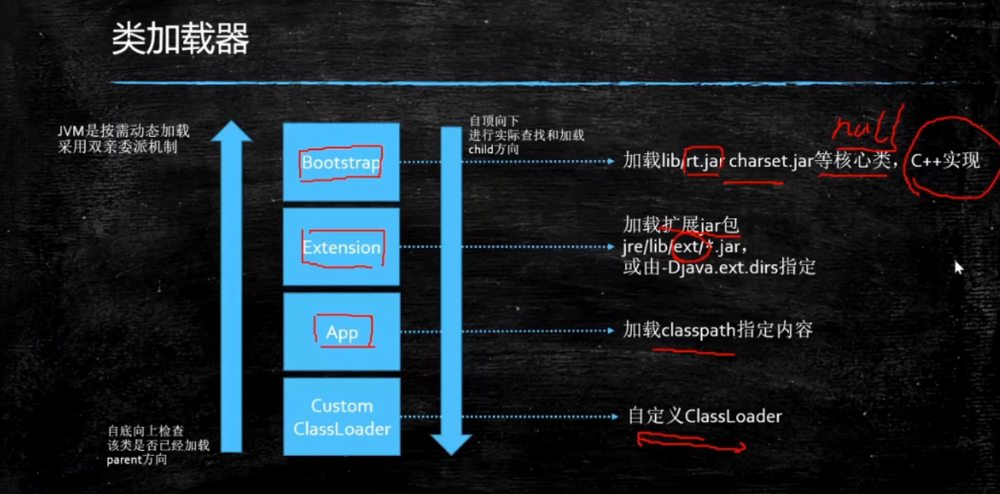
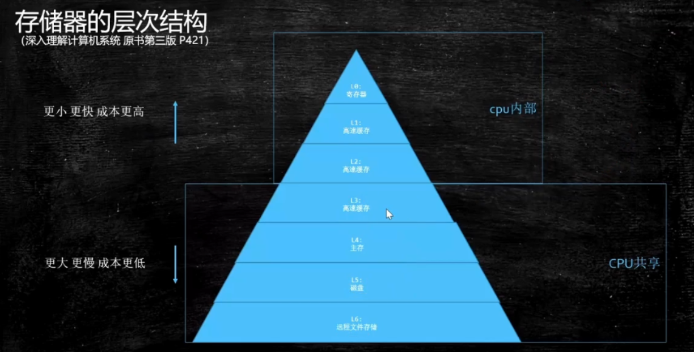

# JVM

## JVM基础入门

java通过javac转译class文件，classLoader通过java类库使用字节码解释器或者JIT即时编译器进行执行引擎；jvm是按需动态加载，采用双亲委派机制

## 类加载-初始化

1. 加载过程

- loading（2进制加载内存）

  - 双亲委派：

    是一个孩子向父亲方向，然后父亲向孩子方向的双亲委派过程。

    1出于安全考虑，2减少加载

  - LazyLoading 的五种情况

    -new getstatic invokestatic指令，访问final变量除外

    -java.lang.reflect对类进行反射调用时

    -初始化子类的时候，父类首先初始化

    -虚拟机启动时，被执行的主类必须初始化

    -动态语言支持java.lang.invoke.MethodHandle解析的结果为REF getstatic REF putstatic REF invokestatic的方法句柄时，该类必须初始化

  - ClassLoader的源码

    findCache----parent.loadClass----findClass()

  - 自定义类加载器

    extend classLoader

    overwrite findClass()-----defineClass(byte[]---class clazz)

    加密

  - 混合执行：编译执行、解释执行

    检测热点代码：-XX:CompileThreshold=1000
    
  - 如何打破：重写loadClass()

  - 何时打破：

    - JDK1.2之前，自定义ClassLoader都必须重写loadClass（）

    - ThreadContextClassLoader可以实现基础类调用实现类代码，通过thread.setContextClassLoader指定。

    - 热启动、热部署

      tomcat都有自己的模块指定classloader

- Linking

  - Verification（校验） 
  - Preparation（将静态变量赋默认值）
  - Resolution（常量池中符号引用转换为内存地址）

- Initializing（静态变量赋值为初始值）

2. 类加载器

3. 存储器的层次结构

- 底层硬件一致性协议：MESI Cache一致性协议（intel的CPU用的，当然还有其他）

现代CPU的数据一致性实现=缓存锁（MESI...）+总线锁

- CPU为了提高指令执行效率，会在一条指令执行过程中（比如去内存读数据（慢100倍）），去同时执行另一条指令，前提是两条指令没有依赖关系。

3. 有序性保障

- CPU内存屏障

sfence：写屏障

lfence:读屏障

mfence:读写屏障

- intellock汇编指令（volitale）

