#  如何将本地的代码上传到github

## 方法1

 首先你需要一个github账号，所有还没有的话先去注册吧！  https://github.com/ 

 我们使用git需要先安装git工具，这里给出下载地址，下载后一路直接安装即可：  https://git-for-windows.github.io/ 

1.  进入Github首页，点击New repository新建一个项目 

 

2.  填写相应信息后点击create即可 

Repository name: 仓库名称

Description(可选): 仓库描述介绍

Public, Private : 仓库权限（公开共享，私有或指定合作者）

Initialize this repository with a README: 添加一个README.md

gitignore: 不需要进行版本管理的仓库类型，对应生成文件.gitignore

license: 证书类型，对应生成文件LICENSE

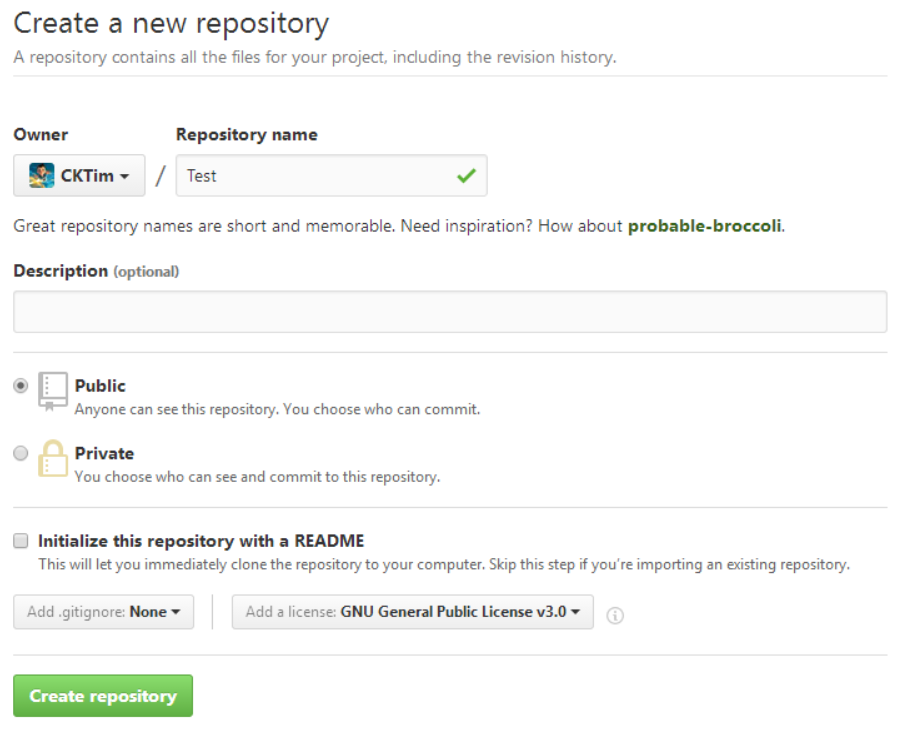

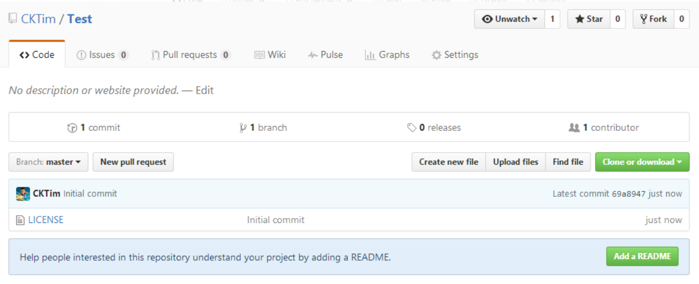

3.  点击Clone or dowload会出现一个地址，copy这个地址备用。 

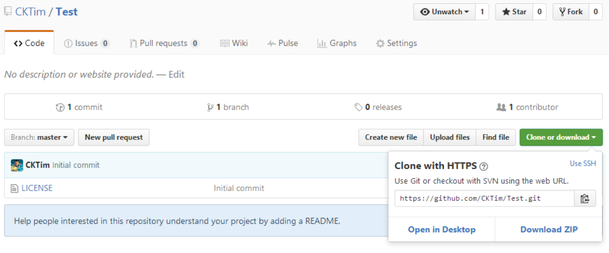

4.  接下来就到本地操作了，首先右键你的项目，如果你之前安装git成功的话，右键会出现两个新选项，分别为Git Gui Here,Git Bash Here,这里我们选择Git Bash Here，进入如下界面，Test_Bluetooth即为我的项目名。 

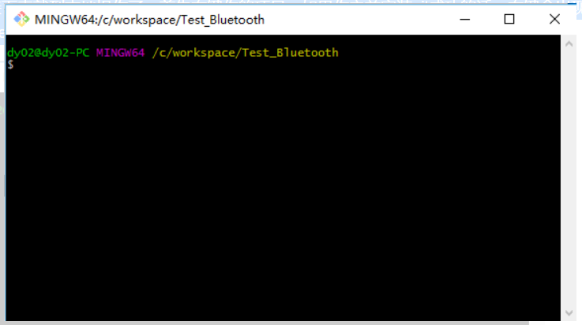

5. 接下来输入如下代码（关键步骤），把github上面的仓库克隆到本地

   git clone https://github.com/CKTim/BlueTooth.git（https://github.com/CKTim/BlueTooth.git替换成你之前复制的地址）

   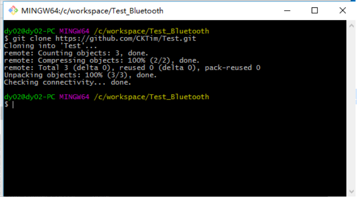

6. 这个步骤以后你的本地项目文件夹下面就会多出个文件夹，该文件夹名即为你github上面的项目名，如图我多出了个Test文件夹，我们把本地项目文件夹下的所有文件（除了新多出的那个文件夹不用），其余都复制到那个新多出的文件夹下，

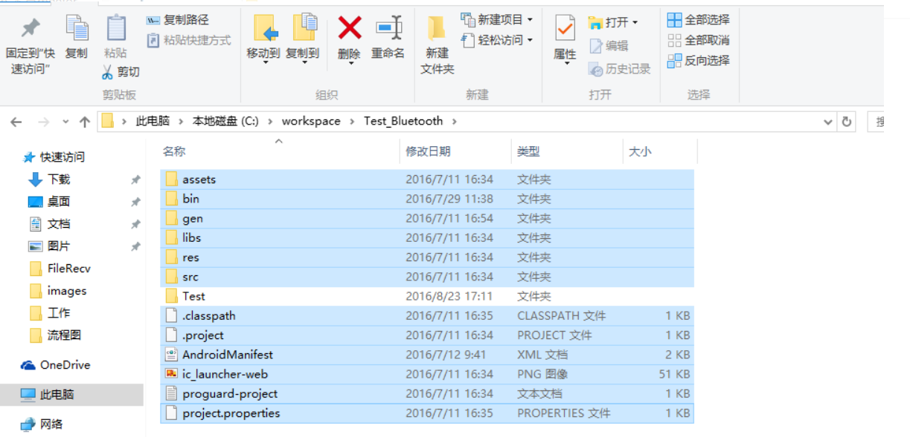

7.  接着继续输入命令 cd Test，进入Test文件夹 

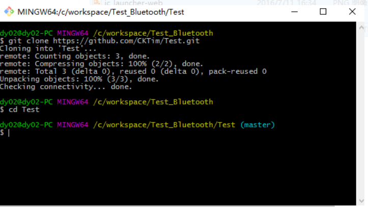

8. 接下来依次输入以下代码即可完成其他剩余操作：

   git add .     （注：别忘记后面的.，此操作是把Test文件夹下面的文件都添加进来）

   git commit  -m  "提交信息"  （注：“提交信息”里面换成你需要，如“first commit”）

   git push -u origin master  （注：此操作目的是把本地仓库push到github上面，此步骤需要你输入帐号和密码）(1160589162@qq.com   )

   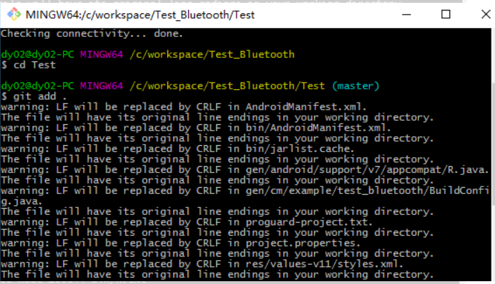

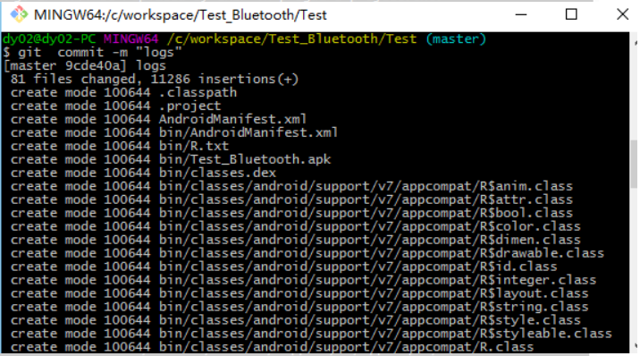

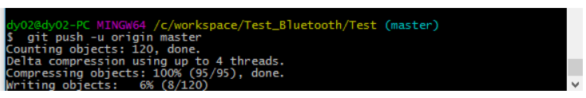

## 方法2

1.  **建立git仓库**
   cd到你的本地项目根目录下，执行git命令 :

   ```java
   git init
   ```

   

2.  **将项目的所有文件添加到仓库中** 

   ```java
   git add .
   ```

 **如果想添加某个特定的文件，只需把.换成特定的文件名即可** 

3.  **将add的文件commit到仓库** 

   ```java
   git commit -m "注释语句"
   ```

4.  **去github上创建自己的Repository，创建页面如下图所示：**

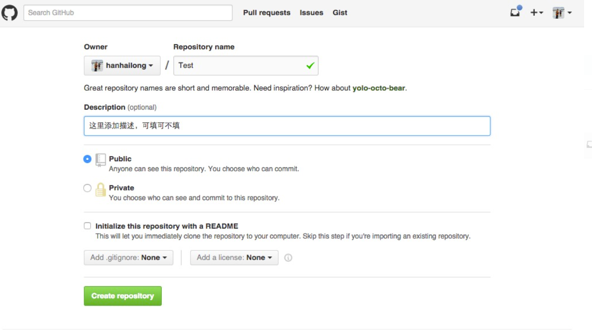

5.  **将本地的仓库关联到github上** 

   ```java
   git remote add origin https://github.com/hanhailong/CustomRatingBar
   ```

6.  **上传github之前，要先pull一下，执行如下命令：** 

   ```java
   git pull origin master
   ```

7.  **上传代码到github远程仓库** 

   ```java
   git push -u origin master
   ```

## 本地提交不需要输入用户名密码

### 使用ssh方式

1.  ssh连接原理 

 在我们提交代码的时候， github需要用我们账号对应的公钥去解密我们提交的代码，如果能正确的解密说明当前提交代码的用户合法的。  **所以在提交代码事先我们的电脑中需要持有一个私钥我们的github账户中也有持有一个公钥** 。


2. 创建ssh key

-  获取公钥： 

  -  .注册一个github账号：[https://www.cnblogs.com/Amedeo/p/76](https://link.zhihu.com/?target=https%3A//www.cnblogs.com/Amedeo/p/7664224.html) 

  -  生成sshkey 

  -  输入如下命令：目的在电脑中生成公钥 

    ```text
    ssh-keygen -t rsa -b 4096 -C 你的邮箱
    ```

    

  -  然后一直回车 直到出现 下面的文字图案（说明公钥生成成功了） 

    ```text
    +---[RSA 4096]----+
    |  . ... oo +=o   |
    |   + +o o.o ooo  |
    |  . B oB   =.= . |
    |   o B  + = = B  |
    |    E   S. * B o |
    |         o+ o . .|
    |       ..o..     |
    |      . =.       |
    |       ..o       |
    +----[SHA256]-----+
    ```

    

  -  查看生成的公钥&将公钥添加到github账户中 

    ```text
    cat ~/.ssh/id_rsa.pub
    ```

    

3. 测试是否成功

    到了这一步我们就在我的电脑中持有了私密，我的github账号中持有了公钥就可以进行ssh连接测试了。 运行命令：

   ```text
   ssh -T git@github.com
   ```

    出现以下提示表示成功哦！！ 

   ```text
   Hi 你的用户名! You've successfully authenticated
   ```